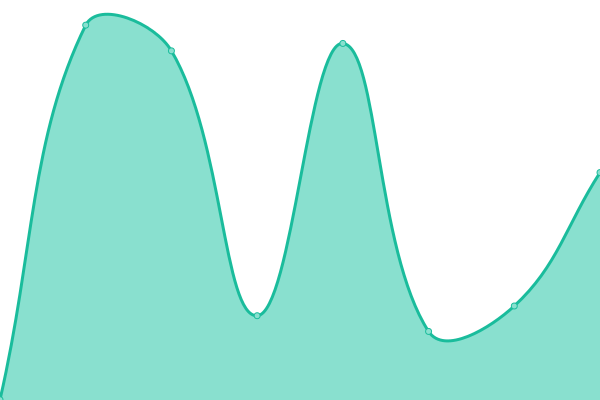
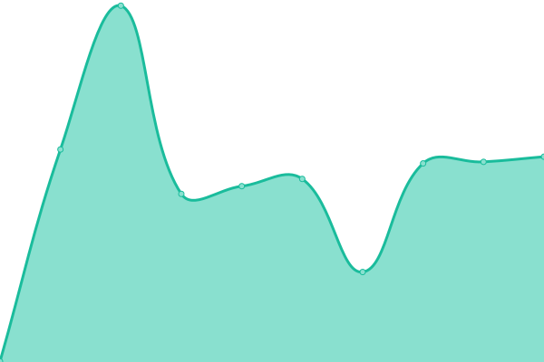

# [📈 Live Status](https://status.mahd.cloud): <!--live status--> **🟩 All systems operational**

This repository contains the open-source uptime monitor and status page for [mahd](https://mahd.dev), powered by [Upptime](https://github.com/upptime/upptime).

With [Upptime](https://upptime.js.org), you can get your own unlimited and free uptime monitor and status page, powered entirely by a GitHub repository. We use [Issues](https://github.com/mahd-dev/mahd-cloud-status/issues) as incident reports, [Actions](https://github.com/mahd-dev/mahd-cloud-status/actions) as uptime monitors, and [Pages](https://status.mahd.cloud) for the status page.

<!--start: status pages-->
<!-- This summary is generated by Upptime (https://github.com/upptime/upptime) -->
<!-- Do not edit this manually, your changes will be overwritten -->
<!-- prettier-ignore -->
| URL | Status | History | Response Time | Uptime |
| --- | ------ | ------- | ------------- | ------ |
|  [Console](https://console.mahd.cloud) | 🟩 Up | [console.yml](https://github.com/mahd-dev/mahd-cloud-status/commits/HEAD/history/console.yml) | 

 733ms
     
 | 

<a href="https://status.mahd.cloud/history/console">100.00%</a>
    

|  [Auth](https://auth.mahd.cloud/debug/healthz) | 🟩 Up | [auth.yml](https://github.com/mahd-dev/mahd-cloud-status/commits/HEAD/history/auth.yml) | 

 296ms
     
 | 

<a href="https://status.mahd.cloud/history/auth">100.00%</a>
    

|  [S3](https://s3.mahd.cloud) | 🟩 Up | [s3.yml](https://github.com/mahd-dev/mahd-cloud-status/commits/HEAD/history/s3.yml) | 

 675ms
     
 | 

<a href="https://status.mahd.cloud/history/s3">100.00%</a>
    

|  [CDN](https://cdn.mahd.cloud) | 🟩 Up | [cdn.yml](https://github.com/mahd-dev/mahd-cloud-status/commits/HEAD/history/cdn.yml) | 

 643ms
     
 | 

<a href="https://status.mahd.cloud/history/cdn">100.00%</a>
    

|  [Mail](https://stalwart.mahd.email/jmap) | 🟩 Up | [mail.yml](https://github.com/mahd-dev/mahd-cloud-status/commits/HEAD/history/mail.yml) | 

 470ms
     
 | 

<a href="https://status.mahd.cloud/history/mail">100.00%</a>
    

|  [Webmail](https://mahd.email) | 🟩 Up | [webmail.yml](https://github.com/mahd-dev/mahd-cloud-status/commits/HEAD/history/webmail.yml) | 

 1002ms
     
 | 

<a href="https://status.mahd.cloud/history/webmail">100.00%</a>
    

<!--end: status pages-->

[**Visit our status website →**](https://status.mahd.cloud)

## 📄 License

- Powered by: [Upptime](https://github.com/upptime/upptime)
- Code: [MIT](./LICENSE) © [mahd](https://mahd.dev)
- Data in the `./history` directory: [Open Database License](https://opendatacommons.org/licenses/odbl/1-0/)
